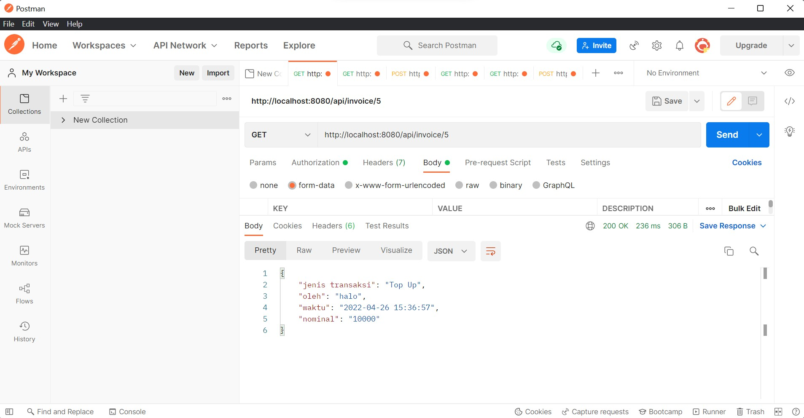

# e-money-kelompok-9
# PAYPHONE REST API

## Kelompok 09
1. Asima Prima Yohana - 5027201009
2. Brilianti Puspita S ari - 5027201070
3. Adinda Putri Audyna - 5027201073

## Register

### Method
`post`

### endpoint
`.../api/register`

### auth
tidak ada 

### parameter 
{username, password, telpon}

### output postman

## Login

### Method
`post`

### endpoint
`.../api/login`

### auth
tidak ada 

### parameter 
{username, telpon}

### output postman

## Top Up

### Method
`post`

### endpoint
`.../api/top-up`

### auth
token

### parameter 
tidak ada

### output postman

## Cek Saldo

### Method
`Get`

### endpoint
`.../api/cek-saldo`

### auth
token

### parameter 
tidak ada

### output postman

## Transfer

### Method
`post`

### endpoint
`.../api/transfer`

### auth
token

### parameter 
{telepon, jumlah}

### output postman

## history

### Method
`get`

### endpoint
`.../api/history`

### auth
token

### parameter 
tidak ada

### output postman

## Invoice

### Method
`get`

### endpoint
`.../api/invoice/5`

### auth
token

### parameter 
tidak ada

### output postman

